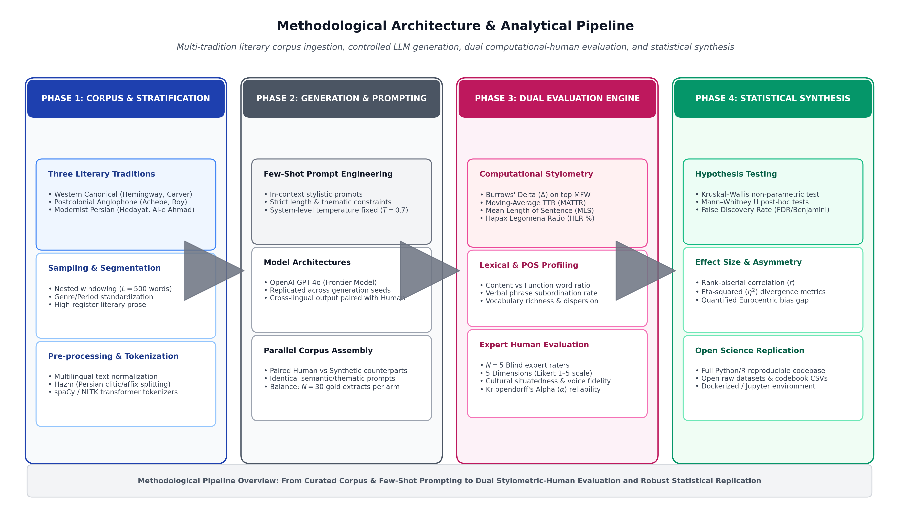
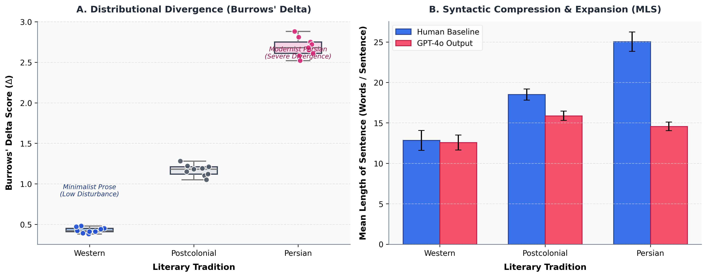
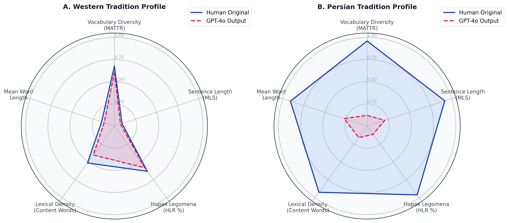
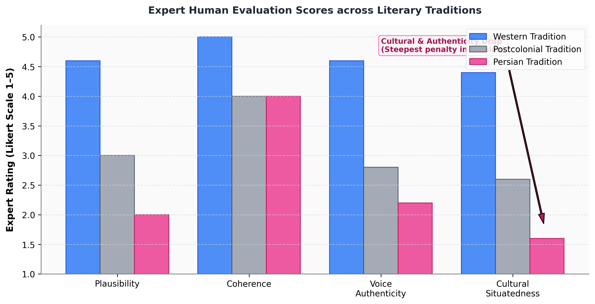

# Measuring Stylistic Asymmetry in Large Language Models: A Stylometric Cross-Tradition Audit

[](https://doi.org/10.5281/zenodo.20612701)
[](https://creativecommons.org/licenses/by/4.0/)
[](LICENSE)
[](https://www.python.org/)
[](https://www.r-project.org/)
[](#reproduction--replication-pipeline)

> **Official Replication & Artifact Repository for:**
> *Measuring Stylistic Asymmetry in Large Language Models: A Stylometric Comparison of Generated Prose Across Literary Traditions*
> **Author:** Pegah Merrikhi
> **Permanent DOI:** [10.5281/zenodo.20612701](https://doi.org/10.5281/zenodo.20612701)

---

## 🖼️ Visual Overview & Empirical Gallery

<table>
  <tr>
    <td width="33%" align="center">
      <b>Graphic Abstract</b><br>
      
    </td>
    <td width="33%" align="center">
      <b>Methodology Pipeline</b><br>
      
    </td>
    <td width="33%" align="center">
      <b>Stylometric Divergence & MLS</b><br>
      
    </td>
  </tr>
  <tr>
    <td width="50%" align="center">
      <b>Stylometric Radar (Human vs. GPT-4o)</b><br>
      
    </td>
    <td width="50%" align="center">
      <b>Expert Human Evaluation</b><br>
      
    </td>
  </tr>
</table>

---

## 📌 Executive Summary & Abstract

LLMs demonstrate remarkable fluency; however, their ability to faithfully reproduce literary styles across diverse traditions remains uneven. This repository contains the complete empirical dataset, stylometric extraction pipelines, and evaluation benchmarks for auditing **stylistic asymmetry** in GPT-4o.

We reveal a pronounced **"stylistic slope"**:
1. **Western Minimalist Prose:** near-native stylistic fidelity.
2. **Postcolonial Anglophone Prose:** moderate flattening.
3. **Persian Modernist Prose:** substantial degradation (Hapax collapse -26.79%; Plausibility 2.00/5).

---

## 📊 Comprehensive Results Tables

### Table 1: Computational Stylometric Benchmarks (Mean ± SD)

| Literary Tradition | Corpus | Burrows' Δ | MATTR | MLS | Hapax (%) |
|:---|:---|:---:|:---:|:---:|:---:|
| Western Minimalist | GPT-4o | 0.428 | 0.740 | 12.57 | 46.94 |
| Postcolonial | GPT-4o | 1.167 | 0.663 | 15.88 | 41.07 |
| Persian Modernist | GPT-4o | 2.689 | 0.580 | 14.57 | 32.14 |

### Table 2: Expert Human Evaluation (1–5 Likert)

| Literary Tradition | Plausibility | Coherence | Cultural Situatedness | Voice Authenticity |
|:---|:---:|:---:|:---:|:---:|
| Western Minimalist | 4.60 | 5.00 | 4.40 | 4.60 |
| Postcolonial Anglophone | 3.00 | 4.00 | 2.60 | 2.80 |
| Persian Modernist | 2.00 | 4.00 | 1.60 | 2.20 |

---

## 🏁 Key Conclusions
- **The Coherence Trap:** While the model generates syntactically coherent prose (Mean Coherence: 4.0/5.0), this masks a "stylistic collapse" in *Voice Authenticity* (2.2) and *Cultural Situatedness* (1.6) in non-Western traditions.
- **Asymmetric Representation:** The model loses its "idiosyncratic fingerprint" as it moves from canonical Western contexts to non-Western corpora.

---

## 📖 Citation

**APA 7th Format:**
> Merrikhi, P. (2025). *Replication Package for "Measuring Stylistic Asymmetry in Large Language Models"* (Version 1.0.0) [Data set & Software]. Zenodo. https://doi.org/10.5281/zenodo.20612701

**BibTeX:**
```bibtex
@misc{merrikhi2025stylistic,
  author = {Merrikhi, Pegah},
  title = {Replication Package for "Measuring Stylistic Asymmetry in Large Language Models"},
  year = {2025},
  publisher = {Zenodo},
  doi = {10.5281/zenodo.20612701},
  url = {https://doi.org/10.5281/zenodo.20612701}
}
